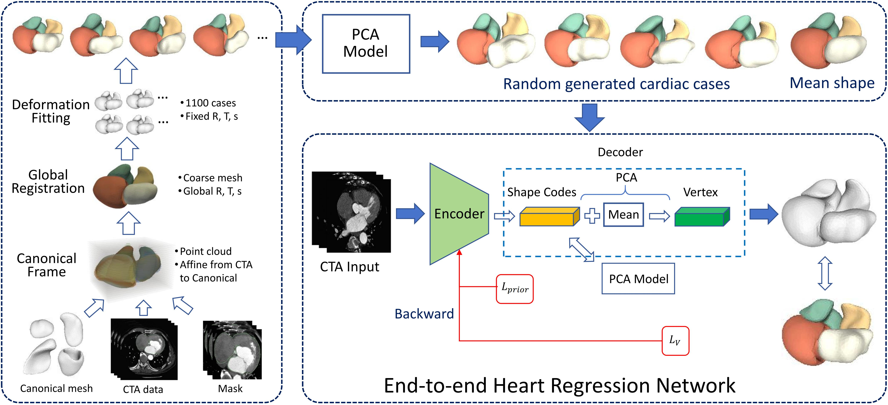

# <div align="center">✨Morphable Heart Model✨</div>

> **"Crafting A Morphable Heart Model for End-to-end Regression"**.

we construct the first morphable heart model (MHM) via a classical PCA-based shape analysis. To demonstrate the utility of MHM, we build an end-to-end regression network that predicts morphable parameters directly from raw CTA input, analogous to established pipelines in digital human modeling.

  


<details open>
<summary>Install</summary>

```bash
conda create -n morphable-heart python==3.8
conda activate morphable-heart
pip install -r requirements.txt
```

</details>

<details open>
<summary>Usage</summary>

### model training
`MMWHS` Dataset

```bash
https://zmiclab.github.io/zxh/0/mmwhs/
```
```
MMWHS
├── img
│   ├── ct_train_1001_image.nii.gz
│   ├── ct_train_1002_image.nii.gz
│   ├── ct_train_1003_image.nii.gz
│   └── ...
└── seg
    ├── ct_train_1001_label.nii.gz
    ├── ct_train_1002_label.nii.gz
    ├── ct_train_1003_label.nii.gz
    └── ...
```

`Cardiac mesh fitting`

```bash
cd Mesh fitting
python FourChambers.py
```

`Run PCA`
```bash
cd PCA
python run_pca_model.py
```
The final results of PCA model will be saved under `./PCA/pca_result_color`.

`Pre-training on synthsis data`
```bash
python train.py
```
After training is completed, the best model weights will be saved at `./checkpoint/best.pt`.

`Finetune on real CTA data`
```bash
./finetune.sh
```
After finetune is completed, the best model weights will be saved at `./finetune_ckpts/best.pt`. We will release the training model weights after this paper is accepted.


### Prediction  
`MMWHS` Dataset

```bash
python inference.py
```

Here, the `predicted cardiac mesh` regressed from finetune model, located at `OUT_OBJ`, where `train_1009_pred_fine.obj` and `train_1009_pred_fine_colored.obj` should be saved. And the reconstruction error and segmentation evaluation will be displayed on terminal. 

