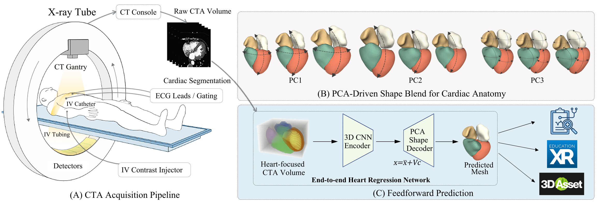

# <div align="center">Morphable Heart Model</div>

This repository accompanies the morphable-heart component of **D-Heart** and
the released baseline regression model **D-Heart-Reg**.

More specifically:

- **D-Heart** refers to the dataset/benchmark, the released CAS
  template-consistent mesh assets, and the PCA morphable shape space derived
  from the fitted meshes.
- **D-Heart-Reg** refers to the regression baseline that predicts morphable parameters / meshes from CTA input.

Benchmark-level D-Heart cohort configuration:

- 1,100 CTA volumes
- CAS 1,000 / MMWHS 60 / WHS++ 40

Current public D-Heart package scope:

- 1,100 CTA volumes
- 1,082 released four-chamber labels
- 1,000 released CAS meshes
- the remaining 18 MMWHS labels are reserved for a later release update
- no per-case public external OBJ meshes

This repository contains:

- the original mesh fitting and PCA construction code,
- released PCA shape assets for **D-Heart**,
- baseline training / fine-tuning code for **D-Heart-Reg**, and
- utilities for rebuilding the released **D-Heart-Reg** pipeline from the public **D-Heart** package.

<p align="center">
  
</p>

## Installation

```bash
conda create -n morphable-heart python==3.8
conda activate morphable-heart
pip install -r requirements.txt
```

## Repository structure

```text
Morphable-heart/
├── Mesh fitting/                # canonical mesh fitting utilities
├── PCA/
│   ├── pca_result_color/        # original PCA assets / legacy layout for the D-Heart shape model
│   └── pca_results/             # released PCA assets used by D-Heart-Reg reproduction
├── scripts/                     # reproducibility scripts for running D-Heart-Reg on the released D-Heart package
├── train.py                     # original synthetic pretraining entry for D-Heart-Reg
├── finetune.py                  # original fine-tuning entry for D-Heart-Reg
├── inference.py                 # prediction / evaluation demo entry for D-Heart-Reg
└── synth_data.py                # synthetic data generation helper
```

## PCA construction

### Original PCA workflow

Cardiac mesh fitting:

```bash
cd "Mesh fitting"
python FourChambers.py
```

Run PCA:

```bash
cd PCA
python run_pca_model.py
```

The original PCA outputs are written under `PCA/pca_result_color/`.

### Rebuilding PCA assets from the released D-Heart package

If you have the released **D-Heart** dataset package available locally, you can
rebuild the PCA assets used by the released **D-Heart-Reg** pipeline from the
public CAS mesh subset:

```bash
python scripts/rebuild_pca_assets_from_cta1100.py \
  --mesh-dir "$DHEART_ROOT/mesh_1000" \
  --out-dir ./PCA/pca_results
```

The rebuilt assets include:

- `mean_shape.npy`
- `pca_components.npy`
- `pca_eigenvalues.npy`
- `template_faces.npy`
- `template_labels.npy`
- `mean.obj`

By default, `scripts/rebuild_pca_assets_from_cta1100.py` uses
`--n-components 0.98`, i.e. it keeps the PCA components selected by the 98%
retained-variance criterion. The released `PCA/pca_results/` asset currently
contains 119 components. Visualizations of PC1--PC4 are compactness/shape-mode
summaries only; D-Heart-Reg uses the retained released basis unless a smaller
PCA asset is explicitly rebuilt.

## Synthetic data generation and D-Heart-Reg training

The reported D-Heart-Reg objective follows the paper: vertex reconstruction
loss plus a raw PCA-coefficient L2 regularizer. Segmentation-mask supervision
is not used for the reported reconstruction baseline.

### Original lightweight workflow

Generate synthetic samples:

```bash
python synth_data.py --pca-dir ./PCA/pca_results --save-dir ./synthetic --num 10000
```

Pre-train:

```bash
python train.py
```

Fine-tune:

```bash
./finetune.sh
```

### Released D-Heart-Reg reconstruction pipeline

The `scripts/` directory contains a more explicit reproduction pipeline for **D-Heart-Reg** on top of the released **D-Heart** package:

1. rebuild PCA assets from released D-Heart meshes,
2. generate synthetic PCA samples,
3. optionally warm-start on synthetic mesh samples,
4. fine-tune on CAS with vertex loss + coefficient prior, and
5. evaluate on the currently released external labeled subset.

Example:

```bash
python scripts/generate_synthetic_dataset_from_pca.py \
  --pca-dir ./PCA/pca_results \
  --out-dir ./runs/dheart_reg_rebuild/synthetic \
  --num-cases 10000

python scripts/train_pretrain_from_synthetic.py \
  --data-dir ./runs/dheart_reg_rebuild/synthetic \
  --pca-dir ./PCA/pca_results \
  --save-dir ./runs/dheart_reg_rebuild/pretrain_ckpts

python scripts/finetune_cta1100_cas.py \
  --image-dir "$DHEART_ROOT/img_1000" \
  --mesh-dir "$DHEART_ROOT/mesh_1000" \
  --pca-dir ./PCA/pca_results \
  --pretrain-ckpt ./runs/dheart_reg_rebuild/pretrain_ckpts/best.pth \
  --save-dir ./runs/dheart_reg_rebuild/finetune_ckpts \
  --epochs 50 \
  --lr 1e-6
```

For the full staged pipeline, see:

- `scripts/nohup_rebuild_pipeline.sh`
- `scripts/launch_full_rebuild_background.sh`

These scripts intentionally use relative or environment-configurable paths so they can be adapted to different local setups without editing source code.
Set `DHEART_ROOT` for one-off commands or `CTA_ROOT` for the staged shell
pipeline; neither variable is hard-coded by the repository.

## Inference / demo evaluation

`inference.py` is kept as a small demo-style entry point for **D-Heart-Reg**. It now accepts explicit CLI arguments instead of relying on hard-coded local paths.
Any mask output from the network is an auxiliary sanity-check output and is
not part of the reported reconstruction objective.

Example:

```bash
python inference.py \
  --pca-dir ./PCA/pca_results \
  --model-weights ./finetune_ckpts/best.pth \
  --input-img "$DHEART_ROOT/img_1000/CAS_0001_image.nii.gz" \
  --gt-mesh "$DHEART_ROOT/mesh_1000/CAS_0001.obj" \
  --out-obj ./prediction.obj
```

The script reports mesh metrics and writes:

- predicted mesh,
- colored predicted mesh,
- aligned reference mesh,
- optional auxiliary mask arrays for sanity checks.

## Notes

- This repository does **not** bundle private local datasets.
- Training checkpoints are not assumed to exist by default; users should supply their own checkpoint paths.
- The released `PCA/pca_results/` assets correspond to the released **D-Heart** morphable shape space.
- The `scripts/` directory is the recommended starting point for reproducing the public **D-Heart-Reg** baseline on the released **D-Heart** package.
